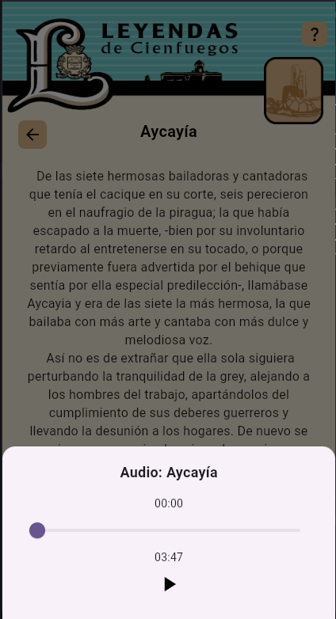

# Cienfuegos Folklore

**Cienfuegos Folklore** is a mobile application developed by **Alexis Manuel Hurtado Garcia** for Alabbi S.U.R.L., which collects and presents the popular legends and tales from the city of Cienfuegos, Cuba. The app allows users to read and listen to the legends with an interactive and accessible user experience.


## Tech Stack

<div style="display: flex; align-items: center;">
  
  
</div>

## Features

- **Animated Splash Screen**: A splash screen with a short video and animations at the beginning of the app.
- **Audio Player**: Users can listen to the narrated legends with a floating audio player.
- **Intuitive Interface**: The app features a clean and accessible design with a custom header at the top of the screen.

## Dependencies

### Main Dependencies

- `animated_splash_screen`: To create an attractive and animated splash screen.
- `flutter_native_splash`: For adding a custom splash screen with the app's logo.
- `flutter_launcher_icons`: To configure and generate custom icons for the app.
- `audioplayers`: For audio playback, allowing users to listen to the narrated legends.

## How to use

   Clone this repository:
   ```bash
   git clone https://github.com/A4GOD-AMHG/Flutter-FolkloreCienfuegos.git

   flutter pub get
   
   flutter run
   ```

   Build the project
   ```
   flutter build apk --split-per-abi
   ```

## Screenshots

<div align="center" style="display: flex; justify-content: center; gap: 30px; flex-wrap: wrap; margin: 30px 0;">
  
  
  
</div>